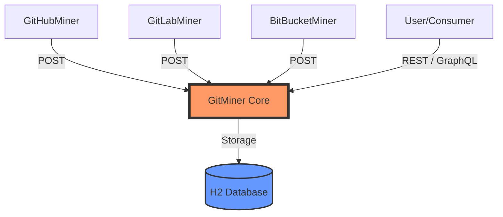

# 🚀 Git Ecosystem Miner

[](https://www.oracle.com/java/technologies/javase/jdk17-archive-downloads.html)
[](https://spring.io/projects/spring-boot)
[](LICENSE)

Welcome to the **Git Ecosystem Miner**, a comprehensive microservices-based project designed to harvest, aggregate, and analyze repository data from the world's leading version control platforms.

## 🏗️ Architecture Overview

The project is structured as a distributed system where multiple **Adapters** fetch data from specific platforms and funnel it into a central **Core Service**.



### 🛰️ Adaptation Layer (The Miners)
These services act as bridges between external APIs and our internal data model.
*   **[GitHubMiner](./GitHubMiner)**: Extracts commits, issues, and comments from GitHub repositories.
*   **[GitLabMiner](./GitLabMiner)**: Adapts data from GitLab instances.
*   **[BitBucketMiner](./BitBucketMiner)**: Interfaces with the BitBucket REST API.

### 🧠 Core Layer
*   **[GitMiner](./GitMiner)**: The heart of the ecosystem. It provides:
    *   **Data Persistence**: Stores projects, commits, and issues in an H2 database.
    *   **REST API**: Classic endpoints for data manipulation and retrieval.
    *   **GraphQL API**: Modern, flexible query interface for complex data relationships.
    *   **OpenAPI/Swagger**: Integrated documentation for all endpoints.

---

## 🛠️ Technology Stack

| Component         | Technology                |
| :---------------- | :------------------------ |
| **Language**      | Java 17                   |
| **Framework**     | Spring Boot 2.7.4         |
| **Database**      | H2 (In-memory)            |
| **APIs**          | REST, GraphQL (Kickstart) |
| **Documentation** | Swagger / OpenAPI 3       |
| **Build Tool**    | Maven                     |

---

## 🚀 Getting Started

### Prerequisites
*   Java 17 or higher
*   Maven 3.6+

### Execution Workflow
Each service is independent. To run the full ecosystem, you should start **GitMiner** first, followed by the adapters of your choice.

1. **Start GitMiner ( Hub )**
   ```bash
   cd GitMiner
   ./mvnw spring-boot:run
   ```

2. **Start an Adapter ( e.g., GitHubMiner )**
   ```bash
   cd GitHubMiner
   ./mvnw spring-boot:run
   ```

### Documentation & Exploration
Once the services are running, you can access the interactive documentation:
*   **Swagger UI**: `http://localhost:8080/swagger-ui/index.html` (Default for GitMiner)
*   **GraphiQL**: `http://localhost:8080/graphiql` (Explore the GraphQL schema)

---

## 📋 Data Model

The ecosystem revolves around a unified domain model:
*   **Project**: Metadata about the repository.
*   **Commit**: Details of code changes, authors, and timestamps.
*   **Issue**: Tracking system data (titles, descriptions, states).
*   **Comment**: Interaction data within the issue tracker.

---

## 🤝 Context

This project was developed as part of the **Software Engineering (Ingeniería del Software)** curriculum. It demonstrates microservices communication, data transformation (ETL), and polyglot API design (REST + GraphQL).

---
Developed with ❤️ by [Ivan J Sevillano](https://github.com/ivansevill), [Dina Samatova](https://github.com/dlunaaa) and [Jose Fernando Gutierrez](https://github.com/jfgm299)
